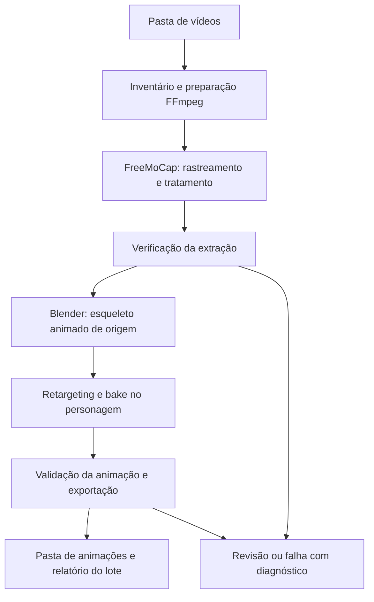

# Video-to-Animation LIBRAS

[English](README_EN.md) · [Planejamento de desenvolvimento](docs/planning.md)

Pipeline offline para transformar uma pasta de vídeos de intérpretes sinalizando em LIBRAS em uma pasta de animações aplicadas a um personagem 3D. O dataset de referência é o **V-LIBRASIL**; o motor de extração é o **FreeMoCap**, e o retargeting e a exportação são feitos no **Blender**.

O objetivo é automatizar o fluxo que pode ser realizado manualmente: preparar o vídeo, extrair o movimento, gerar o esqueleto animado, transferir a animação ao rig do personagem e salvar os resultados. Cada vídeo representa um trabalho independente, com rastreabilidade até a origem.

## Escopo inicial

- Entrada: pasta local de vídeos, incluindo subpastas, com uma pessoa sinalizando por vídeo.
- Prioridade: tronco, braços, punhos e dedos das duas mãos; cabeça conforme os dados disponíveis.
- Um personagem de referência, com rig e mapeamento de ossos configurados uma vez quando definido. O material do usuário está em melhorias; nenhuma escolha de rig foi assumida.
- Saída inicial: um arquivo `.blend` por vídeo aprovado tecnicamente, com personagem e Action baked, preview e relatório de qualidade.
- Processamento sequencial, continuidade após falhas individuais e retomada de trabalhos compatíveis.
- Expressões faciais detalhadas são uma melhoria posterior. O MVP será identificado como animação de corpo e mãos com face não validada.

O escopo é transferir movimentos de vídeos já sinalizados para um avatar. Tradução de fala/texto para LIBRAS e composição automática de frases ficam fora desta primeira versão.

## Fluxo proposto



O FreeMoCap fornece dados de movimento; a integração com Blender transforma esses dados no esqueleto animado de origem. O pipeline reaproveitará esse caminho antes de considerar um solver próprio.

Vídeos independentes de um mesmo sinal são trabalhos separados, não câmeras de uma captura multicâmera. A profundidade monocular é estimada: gerar um arquivo 3D não comprova precisão nem inteligibilidade em LIBRAS. A checagem automática identifica problemas técnicos; a validação de qualidade inclui comparação visual e uma amostra avaliada por pessoas fluentes em LIBRAS. [Documentação de captura monocular do FreeMoCap](https://docs.freemocap.org/documentation/single-camera-recording.html).

## Estado atual

CP1.0–CP1.6 estão implementados: inventário, inspeção, preparação FFmpeg, sessão FreeMoCap mínima, verificação técnica integrada e uma tela Tkinter simples. São etapas independentes da execução do FreeMoCap e do Blender e não alteram os vídeos de origem. Foram verificados 46 testes, incluindo mídias sintéticas, uma amostra real local, hashes, layout de sessão, decodificação, duração, reutilização segura e contratos da interface.

Comandos disponíveis (FFmpeg/ffprobe no PATH para `inspect`):

```powershell
python cli.py --input-dir "./dataset/videos" --output-dir "./output" --until-stage inventory
python cli.py --input-dir "./dataset/videos" --output-dir "./output" --until-stage inspect
python cli.py --input-dir "./dataset/videos" --output-dir "./output" --until-stage verify --profile "./config/profiles/cp1-media-default.yaml"
python gui.py
```

Cada execução salva um JSON em `output/reports/`. Para uso cotidiano, execute `python gui.py`: selecione um vídeo ou pasta, escolha a pasta de saída e clique em iniciar. Veja [uso da ingestão](docs/ingestion.md) para caminhos dos executáveis, metadados e códigos de saída. A validação com vídeos reais do V-LIBRASIL ainda está pendente.

Normalização homologada, execução do FreeMoCap, extração, retargeting, retomada de lote e entrega final continuam pendentes.

Os comandos futuros abaixo são **propostas de interface, ainda não implementadas**:

```powershell
python cli.py --input-dir "./dataset/videos" --output-dir "./output" --avatar "./assets/avatar.blend" --rig-map "./config/rig-map.yaml" --profile "./config/profiles/libras.yaml"
python cli.py --input-dir "./dataset/videos" --output-dir "./output" --avatar "./assets/avatar.blend" --rig-map "./config/rig-map.yaml" --profile "./config/profiles/libras.yaml" --resume
```

A CLI aceita `--input-dir` ou `--video` com `--until-stage` obrigatório, usando as etapas `inventory`, `inspect`, `prepare`, `session` e `verify`, além das opções descritas no guia. Ela executa somente o serviço atual de ingestão e não gera a animação 3D completa:

```powershell
python cli.py --help
python cli.py --video "./video.mp4" --output-dir "./output" --until-stage verify
```

## Ferramentas e ambiente

| Componente | Responsabilidade |
|---|---|
| Python | Inventário, execução por vídeo, configuração, relatórios e retomada. |
| FFprobe / FFmpeg | Inspeção, decodificação e preparação da mídia. |
| FreeMoCap | Extração do movimento e pós-processamento conforme a versão selecionada. |
| MediaPipe / SkellyTracker | Rastreamento utilizado pela integração FreeMoCap escolhida. |
| SkellyForge / NumPy / SciPy | Tratamento e análise dos dados; SkellyForge não é o motor de triangulação. |
| Blender + integração FreeMoCap | Esqueleto de origem, retargeting, bake e exportação. |

A referência local inspecionada é FreeMoCap **1.8.2**, cujos metadados aceitam Python `>=3.10,<3.13`. Python **3.12** é o candidato inicial. A combinação de FreeMoCap, Blender e add-on para extração será fixada no CP0. O personagem e a animação de referência estão em melhorias e permanecem indefinidos; sua integração será validada no CP3. A versão do fluxo manual, quando identificada, orientará a escolha.

O `requirements.txt` atual possui intervalos abertos e ainda não representa um ambiente reprodutível. Não há promessa de compatibilidade com qualquer Blender ou Python mais recente. As releases do FreeMoCap distinguem as linhas 1.x e 2.x; a migração será uma decisão explícita. [Releases oficiais](https://github.com/freemocap/freemocap/releases).

Para preparar o ambiente de desenvolvimento candidato no Windows:

```powershell
py -3.12 -m venv .venv
.\.venv\Scripts\Activate.ps1
python -m pip install -r requirements.txt
```

FFmpeg/ffprobe e Blender são executáveis externos. Seus caminhos e versões serão verificados no preflight das etapas que os utilizam; a integração do Blender ainda pertence aos próximos checkpoints.

## Entrada, saída e confiabilidade

A entrada será um diretório local obtido do [V-LIBRASIL / UFPE](https://libras.cin.ufpe.br/) ou de outra coleção compatível. O inventário verificará os arquivos realmente presentes, sem presumir quantidade, FPS ou organização de uma distribuição específica. Identificadores, glosas e intérpretes serão preservados quando houver metadados; nomes de arquivo não serão tratados automaticamente como rótulos confiáveis.

Estrutura proposta de saída:

```text
output/
  animations/<clip-id>/<run-id>/animation.blend
  animations/<clip-id>/<run-id>/preview.mp4
  animations/<clip-id>/<run-id>/metadata.json
  review/<clip-id>/<run-id>/
  work/<clip-id>/<run-id>/
  reports/batch-<batch-id>.json
```

Trabalhos com suspeita de perda de mãos, troca de identidade, rotação incorreta ou retargeting inválido ficam separados para revisão. Falhas mantêm logs e motivos. A ausência de rosto animado será declarada no metadado, inclusive nos resultados tecnicamente aprovados.

A primeira entrega será `.blend`. FBX e GLB serão acrescentados após validar duração, esqueleto e deformação no consumidor escolhido. O arquivo final com personagem e Action baked é distinto de exportar somente um clip reutilizável: esse segundo contrato será definido com o consumidor.

## Desenvolvimento por checkpoints

1. **CP0:** registrar a referência de extração manual até o esqueleto animado.
2. **CP1:** inventariar a pasta e preparar vídeos compatíveis.
   CP1.0–CP1.6 implementados e testados; a geração da animação 3D continua nos checkpoints seguintes.
3. **CP2:** automatizar FreeMoCap e gerar o esqueleto animado de um vídeo.
4. **CP3:** mapear o rig e aplicar a animação no personagem.
5. **CP4:** calibrar configurações e checagens de confiabilidade.
6. **CP5:** executar lote com isolamento de falhas e retomada.
7. **CP6:** validar entrega, consumidor e desempenho.
8. **CP7, melhoria:** acrescentar animação facial.

Cada checkpoint exige artefatos e verificações descritos no [plano](docs/planning.md). O detalhamento local fica em `docs/step-planning/`, ignorado pelo Git; o plano compartilhado permanece em `docs/planning.md`.

## Licença

O código deste repositório utiliza a [licença MIT](LICENSE). Dataset, modelos, dependências e personagem mantêm suas próprias licenças e condições de uso.
