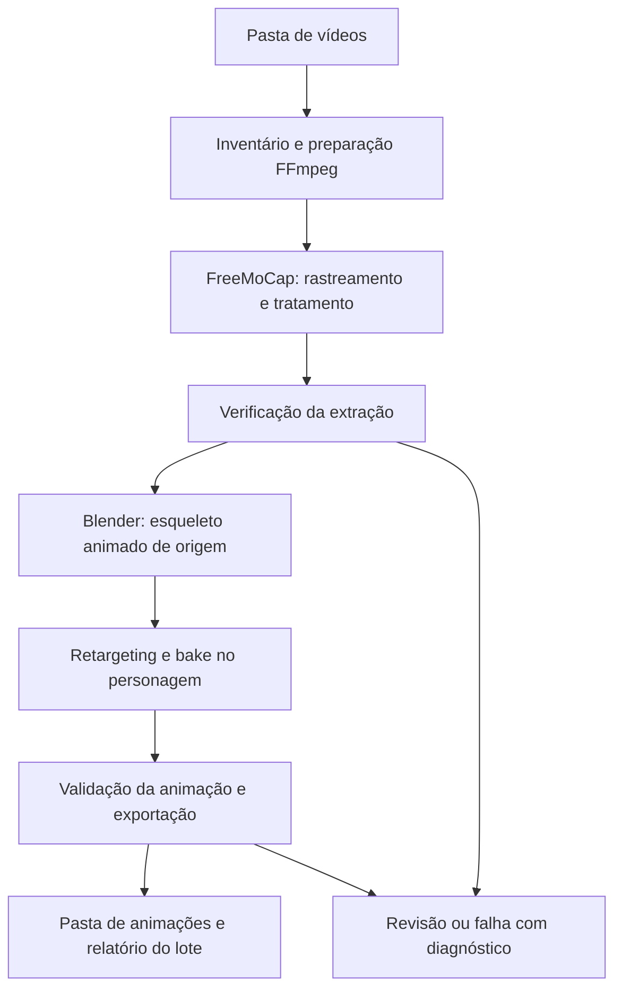

# Video-to-Animation LIBRAS

[](https://opensource.org/licenses/MIT)
[](https://www.python.org/)
[](https://freemocap.org/)
[](https://www.blender.org/)

[English](README.md)

Pipeline offline para transformar uma pasta de vídeos de intérpretes sinalizando em LIBRAS em uma pasta de animações aplicadas a um personagem 3D. O dataset de referência é o **V-LIBRASIL**; o motor de extração é o **FreeMoCap**, e o retargeting e a exportação são feitos no **Blender**.

O objetivo é automatizar o fluxo que pode ser realizado manualmente: preparar o vídeo, extrair o movimento, gerar o esqueleto animado, transferir a animação ao rig do personagem e salvar os resultados. Cada vídeo representa um trabalho independente, com rastreabilidade até a origem.

## Escopo inicial

- Entrada: pasta local de vídeos, incluindo subpastas, com uma pessoa sinalizando por vídeo.
- Prioridade: tronco, braços, punhos e dedos das duas mãos; cabeça conforme os dados disponíveis.
- Um personagem e mapa configurados uma vez. O protótipo CP3 usa o `animation.blend` fornecido: duas mãos e dedos animados, corpo estático por ausência de rig de tronco/braços.
- Saída inicial: um arquivo `.blend` por vídeo aprovado tecnicamente, com personagem e Action baked, preview e relatório de qualidade.
- Processamento sequencial, continuidade após falhas individuais e retomada de trabalhos compatíveis.
- Expressões faciais detalhadas são uma melhoria posterior. O MVP será identificado como animação de corpo e mãos com face não validada.

O escopo é transferir movimentos de vídeos já sinalizados para um avatar. Tradução de fala/texto para LIBRAS e composição automática de frases ficam fora desta primeira versão.

## Fluxo proposto



O FreeMoCap fornece dados de movimento; a integração com Blender transforma esses dados no esqueleto animado de origem. O pipeline reaproveitará esse caminho antes de considerar um solver próprio.

Vídeos independentes de um mesmo sinal são trabalhos separados, não câmeras de uma captura multicâmera. A profundidade monocular é estimada: gerar um arquivo 3D não comprova precisão nem inteligibilidade em LIBRAS. A checagem automática identifica problemas técnicos; a validação de qualidade inclui comparação visual e uma amostra avaliada por pessoas fluentes em LIBRAS. [Documentação de captura monocular do FreeMoCap](https://docs.freemocap.org/documentation/single-camera-recording.html).

## Estado atual

CP1, CP2 e o protótipo CP3 das duas mãos executam pelo serviço compartilhado entre CLI e Tkinter. Um vídeo real gerou animação baked e preview sincronizado, passou na reabertura independente no Blender e recebeu aceite visual do usuário para as duas mãos. Repetições CLI/GUI reutilizam os mesmos artefatos. O protótipo está fechado nesse escopo; corpo completo e validação linguística permanecem separados. Veja o [guia e registro de validação do CP3](docs/cp3.md).

Com o ambiente Python configurado, FFmpeg/FFprobe e Blender disponíveis:

```powershell
python cli.py --video "./Abacaxi_Articulador1.mp4" --output-dir "E:/Video-to-Animation-LIBRAS-CP3/result"
python cli.py --input-dir "./dataset/videos" --output-dir "./output" --until-stage inventory
python cli.py --input-dir "./dataset/videos" --output-dir "./output" --until-stage inspect
python cli.py --input-dir "./dataset/videos" --output-dir "./output" --until-stage verify --profile "./config/profiles/cp1-media-default.yaml"
python gui.py
```

Para uso cotidiano, execute `python gui.py`, selecione o vídeo e a saída e clique em iniciar. A CLI também executa o protótipo completo por padrão. Cada pacote contém `animation.blend`, `preview.mp4` e `metadata.json`. Intermediários e diagnósticos ficam em `.pipeline/` dentro da saída. Confira o preview e registre a revisão pela tela ou CLI para promover o pacote de `review/` para `animations/`.

Repetições compatíveis conferem hashes e reutilizam captura, esqueleto e animação. Calibração geral de perfis, retomada avançada de lote, outros formatos e animação corporal/facial continuam nos checkpoints posteriores. A geração técnica não certifica inteligibilidade em LIBRAS.

Também é possível parar em uma etapa anterior:

```powershell
python cli.py --video "./video.mp4" --output-dir "./output" --until-stage verify
```

A CLI aceita `--input-dir` ou `--video`; `--until-stage` é opcional. Etapas: `inventory`, `inspect`, `prepare`, `session`, `verify`, `extract`, `retarget`. `export` atualmente equivale à entrega `.blend` do CP3; FBX/GLB e `--resume` não estão implementados. O comando parcial `extract` exige perfil e contrato explícitos. Veja [uso da ingestão](docs/ingestion.md) para essas opções.

```powershell
python cli.py --help
python cli.py --video "./video.mp4" --output-dir "./output" --until-stage verify
```

## Ferramentas e ambiente

| Componente | Responsabilidade |
|---|---|
| Python | Inventário, execução por vídeo, configuração, relatórios e retomada. |
| FFprobe / FFmpeg | Inspeção, decodificação e preparação da mídia. |
| FreeMoCap | Extração do movimento e pós-processamento conforme a versão selecionada. |
| MediaPipe / SkellyTracker | Rastreamento utilizado pela integração FreeMoCap escolhida. |
| SkellyForge / NumPy / SciPy | Tratamento e análise dos dados; SkellyForge não é o motor de triangulação. |
| Blender + integração FreeMoCap | Esqueleto de origem, retargeting, bake e exportação. |

O ambiente exercitado no CP3 usa Python 3.12.3, FreeMoCap 1.8.2, Blender 5.2.2 LTS e add-on AJC 2026.4.1039. As versões diretas Python estão em `requirements.txt`; esse arquivo não é lock transitivo nem promessa de compatibilidade com outras versões.

`requirements.txt` reutiliza as versões diretas validadas de `requirements.txt`, evitando uma segunda lista divergente. Não é um lock transitivo nem promessa de compatibilidade com qualquer Blender ou Python mais recente. A migração do FreeMoCap será uma decisão explícita. [Releases oficiais](https://github.com/freemocap/freemocap/releases).

Para preparar o ambiente de desenvolvimento candidato no Windows:

```powershell
py -3.12 -m venv .venv
.\.venv\Scripts\Activate.ps1
python -m pip install -r requirements.txt
```

FFmpeg/ffprobe e Blender são executáveis externos. Seus caminhos e versões serão verificados no preflight das etapas que os utilizam; a integração do Blender ainda pertence aos próximos checkpoints.

## Entrada, saída e confiabilidade

A entrada será um diretório local obtido do [V-LIBRASIL / UFPE](https://libras.cin.ufpe.br/) ou de outra coleção compatível. O inventário verificará os arquivos realmente presentes, sem presumir quantidade, FPS ou organização de uma distribuição específica. Identificadores, glosas e intérpretes serão preservados quando houver metadados; nomes de arquivo não serão tratados automaticamente como rótulos confiáveis.

Estrutura atual de saída do CP3:

```text
output/
  animations/<clip-id>/<run-id>/animation.blend
  animations/<clip-id>/<run-id>/preview.mp4
  animations/<clip-id>/<run-id>/metadata.json
  review/<clip-id>/<run-id>/
  .pipeline/work/<clip-id>/<run-id>/
  .pipeline/reports/
  .pipeline/runtime/
  .pipeline/state.json
```

Trabalhos com suspeita de perda de mãos, troca de identidade, rotação incorreta ou retargeting inválido ficam separados para revisão. Falhas mantêm logs e motivos. A ausência de rosto animado será declarada no metadado, inclusive nos resultados tecnicamente aprovados.

A primeira entrega será `.blend`. FBX e GLB serão acrescentados após validar duração, esqueleto e deformação no consumidor escolhido. O arquivo final com personagem e Action baked é distinto de exportar somente um clip reutilizável: esse segundo contrato será definido com o consumidor.

## Desenvolvimento por checkpoints

1. **CP0:** registrar a referência de extração manual até o esqueleto animado.
2. **CP1:** inventariar a pasta e preparar vídeos compatíveis.
   CP1.0–CP1.6 implementados e testados; a geração da animação 3D continua nos checkpoints seguintes.
3. **CP2:** automatizar FreeMoCap e gerar o esqueleto animado de um vídeo.
4. **CP3:** mapear o rig e aplicar a animação no personagem.
5. **CP4:** calibrar configurações e checagens de confiabilidade.
6. **CP5:** executar lote com isolamento de falhas e retomada.
7. **CP6:** validar entrega, consumidor e desempenho.
8. **CP7, melhoria:** acrescentar animação facial.

Cada checkpoint exige artefatos e verificações descritos no [plano](docs/planning.md). O detalhamento local fica em `docs/step-planning/`, ignorado pelo Git; o plano compartilhado permanece em `docs/planning.md`.
