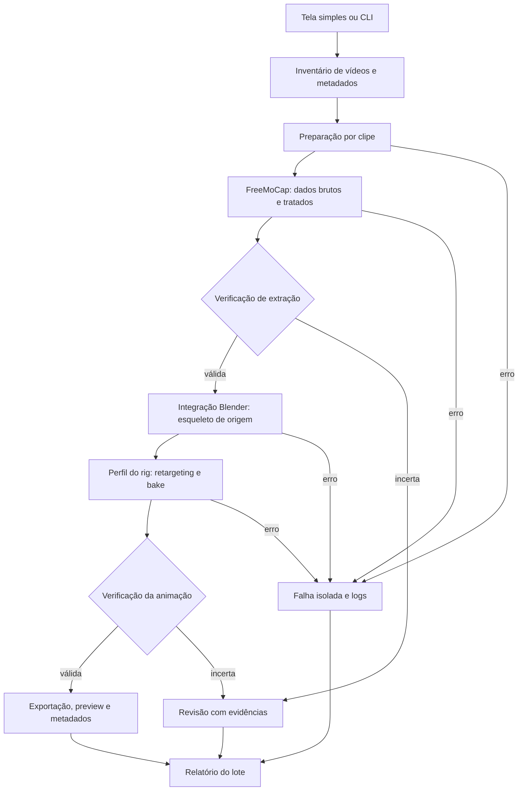

# Plano de desenvolvimento — Vídeos de LIBRAS para animações em lote

## 1. Resultado desejado

Automatizar o fluxo manual **vídeo → FreeMoCap → esqueleto animado → personagem no Blender → arquivo de animação**, repetindo-o para todos os vídeos de uma pasta.

O dataset de referência é V-LIBRASIL. Cada vídeo de um intérprete sinalizando será uma unidade independente de processamento. O usuário prepara uma vez o personagem, o mapa do rig e o perfil de processamento; a execução do lote não deve depender de cliques por vídeo.

A primeira entrega prioriza tronco, braços, punhos e dedos das duas mãos. Cabeça será transferida quando suportada pelos dados; animação facial detalhada é melhoria posterior e não bloqueia o MVP. Registrar `face_animation: false` até que essa capacidade seja validada.

### O que caracteriza sucesso

- Uma pasta local vira um conjunto de animações identificáveis por vídeo de origem.
- O resultado automatizado reproduz o fluxo manual de referência dentro de tolerâncias registradas.
- Configurações efetivamente aplicadas e versões ficam registradas.
- Resultados tecnicamente aprovados, casos para revisão e falhas são distinguíveis.
- Falha em um clipe não elimina resultados dos demais.
- É possível retomar sem repetir etapas válidas nem reutilizar resultados incompatíveis.
- Uma amostra de movimentos do avatar é comparada à fonte e avaliada por pessoas fluentes em LIBRAS; métricas técnicas não são rotuladas como garantia linguística.

Fora do MVP: tradução de fala/texto, composição de frases, multicâmera, solver de captura próprio, suporte genérico a qualquer rig, processamento em tempo real e animação facial completa.

## 2. Estratégia: automatizar uma referência antes de otimizar

Primeiro registrar a extração manual que funcione, incluindo arquivos e configurações. Depois reproduzir esse caso sem interface gráfica. Quando o personagem estiver definido, registrar e automatizar também as operações de retargeting. Só então concluir a comparação de parâmetros no avatar e homologar o lote completo.

A execução terá dois caminhos de uso: uma tela simples para o uso cotidiano e a CLI para automação, depuração e execução em lote sem interface. A tela não terá configurações avançadas no MVP; ela apenas coleta a entrada, a pasta de saída e inicia o mesmo fluxo do orquestrador usado pela CLI.

FreeMoCap permanece o motor de extração. Reutilizar sua integração Blender para gerar o esqueleto de origem; não construir uma armadura procedural ou um novo estimador como requisito inicial. Se uma operação do caminho manual não tiver interface automatizável, isolar essa operação e avaliar uma adaptação mínima antes de ampliar a arquitetura.

As versões/add-ons ainda precisam ser identificados. O usuário informou que tem uma animação em melhorias e solicitou deixar esse material indefinido por enquanto. O personagem, o rig e a animação de referência permanecem pendentes, sem seleção automática. CP0–CP2 validam até o esqueleto de origem; CP3 e a entrega final dependem da definição posterior do personagem. O lote poderá ser exercitado até a etapa de extração enquanto isso.

### Base técnica observada, não homologada

Inspeção local: FreeMoCap 1.8.2 e requisito Python `>=3.10,<3.13`; Python 3.12 é candidato inicial. O fluxo manual informado pelo usuário poderá usar outra versão, e deve orientar a escolha.

Na instalação 1.8.2 foram encontrados:

- `core_processes/process_motion_capture_videos/process_recording_headless.py`, função `process_recording_headless(recording_path, ..., run_blender, make_jupyter_notebook, ...)`.
- `data_layer/recording_models/post_processing_parameter_models.py`, modelo de parâmetros.
- `core_processes/export_data/blender_stuff/export_to_blender/export_to_blender.py`, integração com exportação Blender.
- `RecordingInfoModel` espera `<recording>/synchronized_videos/`; dados brutos ficam em `<recording>/output_data/raw_data/`.
- `flatten_single_camera_data=True` como padrão; isso pode achatar a profundidade. Verificar explicitamente o efeito no clipe de referência.
- O caminho monocular preenche erros de reprojeção com zeros; esses valores não servem como evidência de reconstrução precisa.

Essas são interfaces internas sujeitas a mudança. Concentrar chamadas em um adaptador testado. Não misturar documentação da versão 2.x com código da 1.x. A publicação oficial distingue as linhas e a compatibilidade de gravações ainda depende da versão. [Releases FreeMoCap](https://github.com/freemocap/freemocap/releases).

## 3. Arquitetura proposta



O diagrama descreve execução. A ordem de desenvolvimento abaixo comprova um caminho completo pequeno antes de concluir a calibração das verificações.

| Módulo ou pasta | Responsabilidade |
|---|---|
| `cli.py` | Argumentos, seleção de entrada e códigos de saída. |
| `gui.py` | Ponto de entrada da tela Tkinter para uso cotidiano. |
| `src/application/` | Casos de uso do pipeline compartilhados pela CLI e pela tela. |
| `src/common/` | Hashes, timestamps e persistência atômica compartilhados. |
| `src/ui/` | Tela mínima: seleção de vídeo/pasta, pasta de saída, início, progresso e status, usando o mesmo serviço da CLI. |
| `src/integrations/` | Adaptadores isolados para as integrações futuras de FreeMoCap e Blender. |
| `src/ingestion/contracts.py` | Contratos de entrada, validação de caminhos e publicação de relatórios. |
| `src/ingestion/inventory.py` | Inventário determinístico, metadados e estados de entrada. |
| `src/ingestion/probe.py` | Inspeção read-only com FFprobe/FFmpeg e métricas de decodificação. |
| `src/batch_runner.py` | Fila sequencial, isolamento e retomada; módulo futuro, ainda não implementado. |
| `src/preparation/` | Perfis, comando FFmpeg, staging atômico e manifesto do vídeo preparado. |
| `src/session/` | Materialização e validação do layout mínimo de sessão FreeMoCap. |
| `src/verification/` | Verificação técnica integrada e manifestos de validação. |
| `src/quality.py` | Métricas, regras versionadas e motivos de revisão. |
| `scripts/blender/` | Scripts executados pelo Python do Blender: importar, retargetear, fazer bake e exportar. |
| `config/profiles/` e `config/rig-map.yaml` | Perfil experimental de extração e contrato do personagem. |

Os módulos de CP1 já implementados formam a base compartilhada para a CLI e para a tela futura. Criar módulos de etapas posteriores apenas quando o checkpoint precisar. Manter contratos simples por arquivos entre Python de extração e Blender; não pressupor que todo `site-packages` de um ambiente externo seja compatível com o Python embarcado.

### Tela mínima de operação

A tela do MVP deve caber em uma janela única e mostrar somente:

- um campo de entrada com seletor para um vídeo ou uma pasta de vídeos;
- um campo de saída com seletor da pasta onde as animações e o relatório serão salvos;
- um botão para iniciar o processamento;
- uma barra de progresso e uma mensagem de estado, incluindo o vídeo atual e a etapa atual;
- uma mensagem final com sucesso, revisão ou falha e um atalho para abrir a pasta de saída.

O seletor de entrada deve aceitar arquivo e pasta, deixando explícito que uma pasta é descoberta recursivamente segundo as regras do CP1. A tela deve validar caminhos antes de iniciar, impedir a saída dentro da entrada quando isso puder causar redescoberta e informar erros de seleção sem encerrar silenciosamente. Durante o processamento, os campos e o botão de início ficam bloqueados; deve existir cancelamento controlado que preserve o estado para retomada pela tela ou pela CLI. O progresso representa o lote e deve continuar atualizando durante etapas longas, mesmo quando não houver percentual interno disponível.

Perfis, avatar, mapa do rig e opções avançadas permanecem fora da tela inicial. Até que esses valores tenham defaults homologados, a tela deve exigir um perfil/configuração válida ou informar que a etapa correspondente ainda está indisponível; não deve inventar um personagem ou esconder parâmetros efetivos. O relatório, logs e manifestos continuam sendo a fonte detalhada para diagnóstico.

## 4. Contratos de entrada, saída e rastreabilidade

### Entrada

- Diretório local, descoberta recursiva e ordenação estável de `.mp4`, `.mov`, `.avi` e `.mkv`.
- Arquivos ilegíveis, vazios e formatos não suportados entram no relatório; nenhum é silenciosamente perdido.
- Uma pessoa e uma gravação por arquivo. Vídeos de um mesmo sinal não formam uma sessão multicâmera.
- Metadados do dataset opcionais: preservar ID, glosa, intérprete e repetição quando fornecidos. Não inventar rótulos a partir de nomes sem convenção verificada.
- Inventariar a cópia local antes de definir quantidade, resolução, FPS, organização ou necessidade de pré-processamento.
- Preservar os originais. Excluir a saída da descoberta e rejeitar entrada/saída que provoquem reprocessamento recursivo.

### Identidade

`clip_id`: ID estável baseado no caminho relativo normalizado, com hash para evitar colisões entre nomes iguais. Guardar SHA-256 completo do conteúdo separadamente. Arquivos idênticos com metadados distintos permanecem rastreáveis; eventual reutilização não apaga identidades.

`run_id`: identifica uma execução/configuração. A chave de compatibilidade inclui hash da entrada, parâmetros efetivos, versões de código/backend/modelos, avatar, mapa do rig e opções de exportação. Mudança de conteúdo invalida todas as etapas dependentes; mudança apenas de avatar permite reutilizar extração válida.

### Pastas propostas

```text
output/
  work/<clip-id>/<run-id>/
    source.json
    prepared/video.mp4
    preparation.json
    freemocap/
      synchronized_videos/camera_01.mp4
      session.json
    verification.json
      output_data/...
    source_skeleton.blend
    retargeted.blend
    quality.json
    state.json
    logs/
  animations/<clip-id>/<run-id>/
    animation.blend
    preview.mp4
    metadata.json
  review/<clip-id>/<run-id>/
    metadata.json
    quality.json
    preview.mp4                 # quando for possível produzi-lo
  reports/batch-<batch-id>.json
```

A estrutura interna FreeMoCap será confirmada no CP0. Guardar só um vídeo preparado por clipe em `synchronized_videos`; o original fica fora dessa pasta. Evitar duplicação física entre `prepared` e a sessão quando uma referência compatível for suficiente, sem modificar a fonte.

`.blend` é a entrega mínima: personagem e Action baked, sem dependência do esqueleto externo para reprodução. FBX/GLB serão extensões com teste de importação. Um arquivo contendo personagem animado e um clip apenas de animação são entregas diferentes; escolher a segunda somente com contrato do consumidor definido.

### Manifestos

Registrar esquema, caminhos relativos, hashes, timestamps UTC, FPS racional, duração, frames reais, rotação/espelhamento, transformações, versões e parâmetros efetivos. Acrescentar nomes de rig/Action, eixos/unidades, perfil de qualidade e `face_animation`.

Separar metadados imutáveis de origem de `state.json` mutável por execução. Escritas atômicas. Guardar observações brutas, dados tratados e máscaras de validade/interpolação; resultados finais só são publicados após verificar arquivos.

## 5. Checkpoints de implementação

CP1 está **em andamento**: CP1.0–CP1.6 foram implementados e verificados sequencialmente com 46 testes acumulados, incluindo mídia sintética real e uma amostra local real. O FreeMoCap ainda não foi executado pelo pipeline; CP2 e os demais checkpoints permanecem pendentes.

### CP0 — Reproduzir o fluxo manual

**Objetivo:** transformar a extração manual relatada em uma referência repetível até o esqueleto de origem.

1. Selecionar um vídeo representativo. Manter personagem e animação de referência como pendentes, conforme orientação do usuário.
2. Registrar versões de FreeMoCap, Blender, add-on, modelos e dependências.
3. Registrar parâmetros e operações manuais de importação, tratamento e geração do esqueleto. Documentar retargeting, correções e bake posteriormente no CP3.
4. Identificar quais operações já têm API/script e quais dependem de ação humana.
5. Verificar se o esqueleto exportado possui dedos, punhos e orientações necessários.
6. Salvar fonte, sessão, esqueleto e preview como referência local de extração.
7. Definir conjunto pequeno de calibração e um conjunto separado de validação, com duas mãos, datilologia, contatos, oclusões e variação de intérprete quando disponíveis.

**Aceite:** um caso de extração manual reproduzível e um inventário do rig de origem. Registrar defeitos existentes e o que ainda exige correção manual. Destino e retargeting ficam pendentes para CP3; sua ausência não bloqueia este checkpoint.

**Evidências:** checklist de operações, manifestos de versões, inventário do esqueleto, artefatos e comparação visual. Recursos para executar CP0: vídeo local e detalhes do fluxo de extração; o avatar será necessário apenas a partir de CP3.

### CP1 — Inventário e preparação de vídeo

**Objetivo:** entregar uma sessão válida para o backend selecionado.

**Progresso:** CP1.0–CP1.2 cobrem base/relatórios, inventário e inspeção somente de leitura. CP1.3–CP1.5 foram implementados sobre uma arquitetura separada de preparação, sessão e verificação, e CP1.6 adicionou a tela Tkinter sobre o serviço compartilhado; veja [uso e evidências](ingestion.md). A CLI oferece `--until-stage inventory`, `inspect`, `prepare`, `session` e `verify`. A integração efetiva do backend continua no CP2 e depende do contrato do CP0.

1. Descobrir vídeos, gerar IDs e inventário; preservar metadados do dataset quando disponíveis.
2. Inspecionar mídia com FFprobe: stream, codec, resolução, timestamps, duração, FPS e orientação.
3. Validar decodificação e produzir diagnóstico de entrada inválida.
4. Aplicar o perfil de mídia comprovado no CP0: MP4 decodificável, codec/formato de pixels compatíveis e CFR se exigido pelo caminho escolhido.
5. Preservar FPS útil e resolução de mãos/rosto; não reduzir 60 para 30 por padrão, nem presumir ganho ao duplicar frames.
6. Preservar timestamps da fonte e registrar mapeamento para o derivado. Corrigir rotação conforme política; nunca espelhar sem registrar.
7. Verificar decodificação, cadência e duração do derivado e montar a sessão com um único vídeo.

FFmpeg regulariza FPS descartando ou duplicando frames; preservar duração e rastrear a transformação é obrigatório. Evitar interpolação de movimento artificial no baseline. Não recortar pausas, mudar velocidade ou remover fundo automaticamente. [FFmpeg fps](https://ffmpeg.org/ffmpeg-filters.html#fps).

**Aceite:** formatos suportados cobertos, vídeo VFR tratado conforme política, nomes repetidos sem colisão, fonte intacta, entrada corrompida diagnosticada e backend encontrando exatamente um vídeo por sessão. Testes sintéticos de mídia mais amostra real. Amostragem de decodificação não pode ser reportada como integridade integral.

**Evidências:** inventário, metadados antes/depois, teste de descoberta pelo adaptador e tempos separados de inspeção/conversão. Não impor cinco segundos por minuto sem benchmark.

### CP1.6 — Tela simples de entrada e acompanhamento

**Estado:** implementado com Tkinter em `src/ui/` e `gui.py`. A tela executa o fluxo CP1 completo pelo serviço compartilhado, mantendo a CLI disponível para automação.

**Objetivo:** permitir que uma pessoa processe um vídeo ou uma pasta sem precisar memorizar comandos da CLI.

1. Escolher uma tecnologia de janela compatível com o ambiente homologado e manter a tela desacoplada do código específico do FreeMoCap e do Blender.
2. Expor seleção de arquivo de vídeo ou pasta de vídeos e seleção da pasta de saída; validar os caminhos antes de criar o lote.
3. Reutilizar a mesma API de serviço da CLI para criar a execução, aplicar o perfil selecionado por configuração e publicar as saídas.
4. Exibir progresso global, vídeo atual, etapa atual e mensagens de revisão/falha vindas do relatório, sem substituir os logs detalhados.
5. Executar o processamento em worker separado da thread da interface para manter a janela responsiva; atualizar a tela por eventos de estado persistidos em `state.json`.
6. Permitir cancelamento controlado e retomada de uma execução compatível, respeitando os hashes e as regras do CP5.
7. Exibir o resultado final e permitir abrir a pasta de saída; registrar a mesma execução independentemente de ter sido iniciada pela tela ou pela CLI.

**Fora deste checkpoint:** editor de parâmetros, visualização 3D, reprodução do vídeo, fila de múltiplos lotes, login, processamento em tempo real e escolha automática de avatar/rig.

**Aceite:** uma pessoa consegue selecionar um vídeo e uma pasta de saída, iniciar um processamento de teste, acompanhar a etapa atual e localizar o resultado sem usar a CLI. O mesmo teste iniciado pela CLI produz contratos equivalentes. A janela permanece responsiva, entradas inválidas são explicadas, cancelamento não corrompe o estado e uma retomada compatível não repete etapas concluídas.

**Evidências:** captura ou roteiro reproduzível da tela, teste de arquivo único e pasta, validação de caminhos, atualização de progresso, cancelamento/retomada e comparação do relatório gerado pela tela com o gerado pela CLI.

**Evidências atuais:** construção da janela validada no Windows, testes de contrato para seleção/progresso e execução da regressão com 46 testes aprovados. O cancelamento é tratado entre etapas; a repetição da execução reutiliza artefatos compatíveis pelos hashes. A geração de animação 3D permanece fora do CP1 e será ativada pelos checkpoints posteriores.

### CP2 — Automatizar FreeMoCap e o esqueleto de origem

**Objetivo:** reproduzir a extração manual de um vídeo sem cliques.

1. Fixar o ambiente escolhido no CP0 e testar imports/assinaturas.
2. Executar FreeMoCap por adaptador, preferencialmente em processo isolado.
3. Traduzir o perfil do projeto para os modelos de parâmetros reais; rejeitar opção não suportada em vez de ignorá-la.
4. Registrar parâmetros efetivos, incluindo FPS usado pelo filtro e tratamento monocular de profundidade.
5. Preservar dados brutos e tratados e gerar overlay para verificar mãos e identidade.
6. Executar a integração Blender validada para produzir `source_skeleton.blend`.
7. Validar contagem de frames, duração, hierarquia, ossos necessários, curvas e transforms finitos.

A captura monocular do FreeMoCap é uma rota suportada, mas não equivale a triangulação calibrada. A geometria e a profundidade devem ser verificadas no resultado. [Guia monocular](https://docs.freemocap.org/documentation/single-camera-recording.html).

**Aceite:** processamento sem GUI até esqueleto animado, equivalente à referência dentro de tolerâncias registradas antes da comparação. Ausência de dedos ou saída achatada inadequada impede aprovação, mesmo com processo encerrado sem erro.

**Evidências:** overlay, arrays, arquivo de origem, comparação de transforms nos mesmos instantes e logs. Não exigir identidade binária de arquivos Blender; comparar conteúdo e movimento.

### CP3 — Retargeting e bake em um personagem

**Objetivo:** entregar a primeira animação completa do personagem para um clipe.

**Entrada pendente:** definição do personagem/rig e da animação manual de referência, atualmente em melhorias. Não selecionar um substituto nem considerar essa etapa aprovada enquanto estiverem indefinidos.

1. Registrar o retargeting manual de referência com o material definido e criar perfil único do rig: armature de origem/destino, nomes de ossos, pose de repouso, eixos, escala e correções de orientação.
2. Validar tronco, ombros, braços, antebraços, punhos, dedos e polegares; cabeça quando disponível.
3. Reproduzir o método manual de retargeting por script. Mapeamento nominal sozinho não corrige eixos e proporções.
4. Aplicar IK/FK e correções locais apenas conforme necessidade demonstrada; não substituir o rig/solver validado sem motivo.
5. Preservar orientação das palmas, torção do antebraço, contatos e duração.
6. Fazer bake da Action no personagem; remover dependências temporárias da cena de entrega.
7. Salvar `animation.blend` e preview comparável à fonte; reabrir em outro processo Blender.

Não exigir T-pose no início de todos os vídeos: estabelecer pose de referência dos rigs uma vez. Limites articulares são auxiliares e não garantem ausência de colisões.

**Aceite:** personagem anima sem depender da cena de origem, ambas as mãos e dedos movem corretamente, eixos e duração conferem e o clipe pode ser avaliado visualmente. Registrar avaliação inicial de pessoa fluente quando disponível; não marcar validação linguística sem essa evidência.

**Evidências:** mapa versionado, Action, arquivo reaberto, preview e relatório das diferenças. Rosto não é requisito de aprovação do CP3.

### CP4 — Configurações e confiabilidade

**Objetivo:** escolher um perfil comprovado na amostra e classificar falhas.

1. Estabelecer o perfil manual como baseline.
2. Comparar pequeno conjunto de parâmetros suportados: modelo/complexidade, limiares de detecção, profundidade monocular, filtro ligado/desligado, corte/ordem e preenchimento de lacunas.
3. Alterar uma família por vez e manter custo de experimento controlado.
4. Avaliar dados brutos, tratados e avatar; evitar escolher o resultado apenas por parecer mais suave.
5. Fixar perfil e limiares no conjunto de calibração; testar no conjunto reservado sem reajustar para cada resultado.
6. Separar regras determinísticas de integridade de heurísticas de qualidade e evidência humana.

Não existe configuração universalmente melhor. Cutoffs de 5–8 Hz e confiança de 0,70 não são garantias. Evitar filtragem duplicada pelo FreeMoCap e pelo pipeline. O filtro deve respeitar amostragem, trechos curtos e lacunas; suavização não pode apagar movimentos rápidos. [SciPy Butterworth](https://docs.scipy.org/doc/scipy/reference/generated/scipy.signal.butter.html).

| Verificação | Medida proposta | Ação |
|---|---|---|
| Integridade | Arquivos legíveis, frames, timestamps, arrays/transforms finitos | Falhar em inconsistência estrutural. |
| Cobertura de mãos | Frames válidos por mão e maior lacuna em milissegundos | Revisão se insuficiente; dado indisponível permanece desconhecido. |
| Identidade | Suspeitas de troca esquerda/direita, continuidade em cruzamentos | Marcar intervalos e revisar overlay. |
| Movimento | Jitter nas pausas, variação de comprimentos, orientação de palma e saltos normalizados | Comparar com referência; evitar corte universal em centímetros. |
| Interpolação | Fração reconstruída e maior intervalo preenchido | Revisão de lacunas excessivas; nunca ocultar reconstrução. |
| Retargeting | Ossos/Action, escala, duração, limites e contatos visuais | Falha estrutural ou revisão visual. |
| Amostra humana | Configuração, orientação, localização, movimento e entendimento | Registrar avaliador, protocolo, observações e resultado. |

Scores de detecção e handedness não equivalem a precisão por articulação. Os campos realmente disponíveis dependem do tracker. Na API Hand Landmarker, coordenadas e classificação de lateralidade são saídas documentadas; não inventar confiança dos dedos. [Hand Landmarker](https://developers.google.com/edge/mediapipe/solutions/vision/hand_landmarker/python).

O status de qualidade será `pass`, `review` ou `fail`, com motivos, intervalos e versão das regras. Métrica obrigatória ausente resulta em `review`, não em aprovação automática. Falhas de captura antes do rig podem interromper o restante do clipe. Suspeitas preservam evidências, podendo produzir preview candidato em `work`/ `review`, sem publicar em `animations`.

**Aceite:** perfil versionado, limiares explícitos justificados por calibração, casos bons/ruins conhecidos corretamente encaminhados e resultado no conjunto reservado documentado. Sem amostra ou métricas suficientes, o checkpoint permanece pendente.

### CP5 — Lote, isolamento e retomada

**Objetivo:** executar uma pasta completa usando os componentes já comprovados.

1. Fila sequencial por padrão; CLI comum para arquivo único ou pasta.
2. Estado por etapa: `pending → running → succeeded | failed`; retomadas compatíveis podem ser `skipped`.
3. Qualidade separada do estado de execução: um processo pode ter sucesso e resultado para revisão.
4. Timeouts por processo, cancelamento controlado, logs individuais e exclusão mútua para evitar dois escritores no mesmo trabalho.
5. Interrupção deixa etapa incompleta; na retomada, verificar arquivos/hashes antes de reusar.
6. Invalidar apenas etapas afetadas por mudanças em entrada, perfil, avatar, mapa ou exportação.
7. Continuar após falha local; falha global de preflight interrompe antes de iniciar lote caro.
8. Publicar atomicamente entregas aprovadas, preservando execuções anteriores.
9. Relatório consolidado com cada entrada, resultado, motivos, caminhos e tempo por etapa.

CLI do lote completo proposta abaixo; a interface parcial de inventário/inspeção já implementada está no [guia da ingestão](ingestion.md). As demais etapas e opções continuam futuras:

```text
--input-dir / --video       entradas mutuamente exclusivas
--output-dir               raiz de trabalho, relatórios e animações
--avatar --rig-map          necessários para retargeting/exportação
--profile                  perfil de mídia, FreeMoCap e qualidade
--until-stage              prepare | session | verify | extract | retarget | export
--resume                   reutilizar somente etapas compatíveis e verificadas
--limit                    limitar lote para experimentos
```

`prepare` termina no vídeo preparado e não requer Blender; `session` acrescenta o layout mínimo de sessão e também não executa FreeMoCap; `verify` executa as três etapas anteriores e revalida seus artefatos. `extract` inclui os dados FreeMoCap e o esqueleto de origem `source_skeleton.blend`, portanto requer Blender, mas não requer personagem nem mapa de destino. `retarget` e `export` exigem o personagem definido no CP3. A aprovação de uma execução parcial vale somente para as etapas solicitadas; não representa conclusão do pipeline completo.

Preflight verifica apenas dependências das etapas solicitadas. Códigos de saída propostos: 0 para lote todo aprovado tecnicamente, 2 para lote concluído com revisões/falhas individuais, 1 para erro global. Cancelamento recebe código distinto documentado na implementação.

**Aceite:** lote de teste com vídeo válido, corrompido e nomes repetidos; falha local isolada; interromper e retomar; mudar apenas rig e comprovar reutilização da extração; mudar vídeo e comprovar invalidação. Conferir que toda entrada aparece uma única vez no relatório com status final.

O CP5 deve incluir um ensaio iniciado pela tela para confirmar que o caminho visual acompanha o mesmo estado, progresso, cancelamento e relatório do caminho de CLI. A tela pode iniciar arquivo único ou lote, mas não deve criar uma segunda implementação do pipeline.

### CP6 — Entrega e validação final do MVP

**Objetivo:** produzir uma coleção utilizável de animações no formato acordado.

1. Consolidar `.blend`, preview e metadados como contrato mínimo.
2. Se necessário, acrescentar FBX ou GLB, um por vez, conforme consumidor.
3. Validar reimportação, duração, ossos, orientação, escala e deformação em processo/consumidor independente.
4. Confirmar que constraints de retargeting foram baked e que apenas a Action desejada é exportada.
5. Executar conjunto reservado e amostra humana; relatar defeitos e limitação da face.
6. Medir tempo por etapa, RAM/VRAM e disco no hardware identificado.
7. Documentar operação, recuperação de falhas, perfil homologado e limites do corpus.

GLB não implica compressão automática de animações. Não exigir simultaneamente todos os formatos ou 15 MB independentemente do personagem/duração. Preview preserva cadência útil, enquadramento de mãos e região superior do corpo. [Exportação glTF no Blender](https://docs.blender.org/manual/en/4.4/addons/import_export/scene_gltf2.html).

**Aceite:** pasta de entrada processada sem ação manual por clipe, relatório completo, animações aprovadas reabrindo no destino e qualidade demonstrada na amostra definida. Casos encaminhados para revisão são resultados legítimos do lote, mas não contam como animações aprovadas. Se ainda houver correção humana obrigatória em todos os clips, o objetivo de automação completa não foi atingido.

### CP7 — Melhoria posterior: rosto

Acrescentar captura de expressões, rig facial, mapeamento para shape keys/bones, bake e exportação sincronizados com corpo/mãos. Primeiro auditar dados faciais já produzidos pela versão escolhida; depois avaliar componente adicional se necessário. Validar nova capacidade com amostra específica e atualizar esquema/perfil. Não reclassificar retrospectivamente o MVP como facialmente completo.

## 6. Qualidade transversal e testes

- Unitários: IDs, contratos, decisões de qualidade, regras de invalidação e aplicação de configuração.
- Mídia sintética: formatos, VFR/CFR, orientação, duração, caminhos Unicode/espaços e corrupção.
- Integração real: FreeMoCap e Blender na combinação fixada; testar dependências além de mocks.
- Regressão: clipe manual de referência, amostra de calibração e conjunto reservado.
- Testes visuais/humanos: orientação, dedos, contatos e fidelidade ao vídeo.
- Testes de operação: falha parcial, cancelamento, retomada, arquivo final incompleto e mudança de perfil.

Limiares numéricos de erro/performance serão registrados antes do aceite correspondente, com justificativa e hardware. Não usar um score agregado para esconder uma mão ausente.

## 7. Requisitos e rastreabilidade

| Requisito | Checkpoints | Evidência |
|---|---|---|
| R1 — Pasta e identificação por vídeo | CP1, CP5 | Inventário e relatório sem colisão/perda. |
| R1.1 — Uso simples sem CLI | CP1.6, CP5 | Seleção de vídeo/pasta, pasta de saída, progresso, cancelamento e acesso ao resultado. |
| R2 — Mídia compatível e fonte preservada | CP1 | Inspeção/decodificação e sessão aceita. |
| R3 — FreeMoCap automatizado com parâmetros aplicados | CP0, CP2 | Comparação manual/automática e parâmetros efetivos. |
| R4 — Corpo e mãos no personagem | CP3 | Mapa, bake, arquivo reaberto e preview. |
| R5 — Confiabilidade e escolha de perfil | CP4 | Métricas, motivos e avaliação de amostra. |
| R6 — Lote sem cliques, com retomada | CP5 | Interrupção/falha simuladas e reexecução compatível. |
| R7 — Entregas utilizáveis | CP6 | Reimportação e validação no destino. |
| R8 — Rosto opcional | CP7 | Animação facial validada separadamente. |

## 8. Registro de progresso e próxima ação

Para cada checkpoint, registrar em `docs/step-planning/`: estado, hipótese, alterações, comando exato, entradas/hashes, configuração, artefatos, verificações e resultado, limitações e próximo passo. Estados: não iniciado, em andamento, validado ou bloqueado com motivo. Um teste não executado deve ser marcado como tal.

O plano compartilhado fica aqui. O diretório local de checkpoints é ignorado pelo Git conforme solicitado; decisões consolidadas necessárias a outros desenvolvedores devem ser promovidas para este documento ou outra página versionada em `docs/`.

O acompanhamento local fica em `docs/step-planning/progresso.md`. Ensaios de lote até `extract` podem avançar enquanto o personagem está pendente; CP5 completo continua exigindo a verificação de retomada do retargeting e da exportação.

Próximo incremento: CP2, executando o FreeMoCap por adaptador e homologando o perfil com o contrato final definido no CP0. CP1.3–CP1.6 estão implementados e verificados; CP3 aguardará a definição do personagem/animação de referência.

## 9. Referências e origem dos dados

- [V-LIBRASIL, portal UFPE](https://libras.cin.ufpe.br/): origem de referência indicada para a coleção. A cópia local e seus metadados ainda serão inspecionados; nenhuma contagem ou FPS foi presumido.
- Fontes técnicas estão vinculadas nas decisões correspondentes acima.
- Código de FreeMoCap 1.8.2 instalado localmente: interfaces, layout e defaults registrados na seção 2. Precisam ser reconfirmados se a versão escolhida no CP0 mudar.
- Código atual: CLI e tela Tkinter de ingestão, preparação, sessão e verificação implementadas; adaptadores de extração e exportação permanecem experimentais. Evidências dos testes de CP1.0–CP1.6 estão no [guia](ingestion.md).
